<html>

          
<body>

<h2>Predicting the Gas Mileage of your New Vintage Car</h2>
The project intertwines Tableau and Machine learning to predict mpg values for cars in the 70's and 80's. The <a href="https://vintagecarsmpg.herokuapp.com/is">website</a>   is deployed utilizing Flask and Heroku and the visualizations are available at Tableau Public: <a href="https://public.tableau.com/profile/dana.woodruff#!/vizhome/Vintage-Car-MPG/VintageCars?publish=yes">Vintage-Cars-MPG.</a>  

<kbd>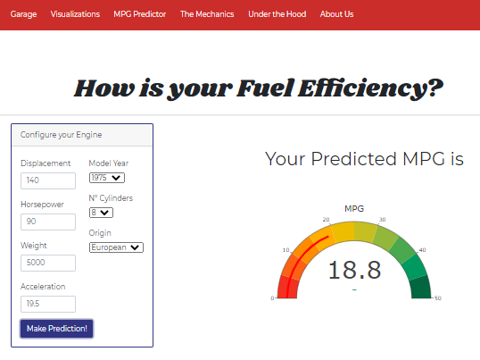</kbd>
   
<h2>Vintage Cars' Journey Towards Fuel Efficiency - with user interactivity</h2>
Tableau visualizes the journey automobiles took from 1970 to 1982 as world events incentivized manufacturers to reduce vehicle weight and horsepower to improve fuel efficiency. Our road begins with understanding how world oil prices and MPG trended over the twelve years included in the dataset. 
 

<kbd></kbd>
 
<h3>Data</h3>
Data is gratiously sourced from <a href="http://archive.ics.uci.edu/ml/datasets/Auto+MPG">Kaggle and the University of California, Irvine.</a> 
 
The original data .csv file is relatively clean.  It is a small dataset, approximately 400 records, and Excel was used for the minimal cleaning required. Six null values in "horsepower" field were replaced with the manufacturers' specified values. Make and model values were separated into independent fields utilizing Excel's native "text to columns" functionality, for better Tableau visualization prospects.  "Make" was listed as unique values to spot misspellings which were then corrected and was capitalized for better tableau visualization.   
 
The clean .csv was read into Tableau. Data fields include make, model, model year, horsepower, engine displacement, engine cylinders, acceleration, fuel efficiency, and vehicle weight. 
 
A second .csv was imported that provides inflation adjusted <a href="/Data/Oil_Prices.xlsx">world oil prices</a> for each of the twelve years. 
 
"Model Year" and "Country" are selected as global filters for the dashboards.
 
<h3>Dashboards and Story</h3>
Ten worksheets each have a visualization. The visualizations are brought together on six dashboards which are then presented as a story.  The main filter serves to retrieve data for each year unless the data is presented as a time series. The story captions summarize each dashboard and guide the user through the dashboards. 
 
Our story begins in 1970...Elvis Presley and Creedence Clearwater Revival played on the radios of heavy cars that boasted big engines and horsepower. Gas was cheap and the cars averaged 17 MPG. By 1982 the world's industrialized countries had suffered two oil crises and Elvis had left the building. Engine horsepower was down to 81hp but fuel efficiency was up 88%. 
 

<kbd></kbd>

 
Next the user explores how country of origin influences fuel efficiency.  Asia is the frontrunner for the time period with the United States and England trailing the pack. The user can select which year(s) to view and tooltips provides the average metrics for each field. 
 

<kbd></kbd>

   
Individual make and fuel efficiency are examined in the third dashboard. The dashboard is generous with labels to provide an easy view of data and, again, tooltips are utilized to provide a wider data view. A summary by country also functions as a legend in the lower right corner. 
 

<kbd></kbd>

 
The user then explicity views the 46% reduction in horsepower between 1970 and 1982.  
 

<kbd></kbd>

   
Engine metrics roar to life in the final two dashboards.  A 28% decrease in weight, a 45% decrease in horsepower, and a 55% decrease in engine displacement contributed to the 88% MPG improvement and a 31% improvement in acceleration. 
 
Blended and dual axis scales allowed the three independent metrics to show with a shared x-axis. 
 

<kbd></kbd>&nbsp;&nbsp;&nbsp;<kbd></kbd>

 
<h3>Machine Learning</h3>
 
The <a href="http://archive.ics.uci.edu/ml/datasets/Auto+MPG">dataset</a> is imported into Jupyter Notebook and read into a pandas dataframe.  Data is examined for null values and understood prior to machine learning model implementation. 
 

<kbd>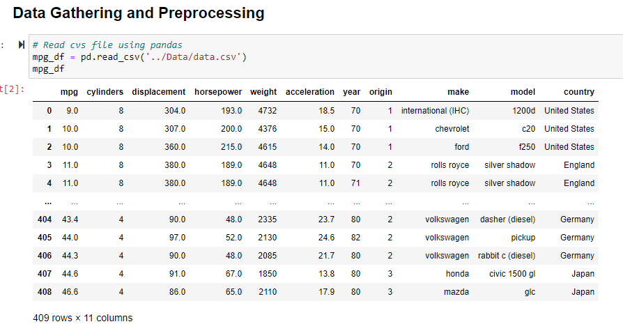</kbd>

 
Pandas' "describe" function is used to understand the dataset's fields relationship to one another. 
 

<kbd>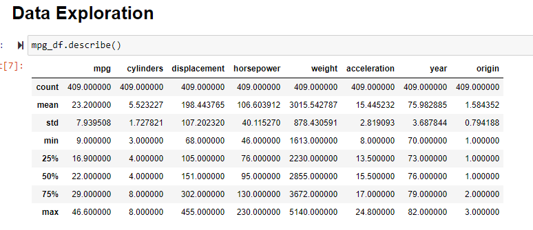</kbd>

 
Examination for correlations is made both as a dataframe and a visualization.  
 

<kbd></kbd>

 
Pair plots, another correlation tool, clearly demonstrates that "cylinders" and "origin" fields do not shows a normal distribution as they represent a specific value and can be considered categorical values. 
 

<kbd>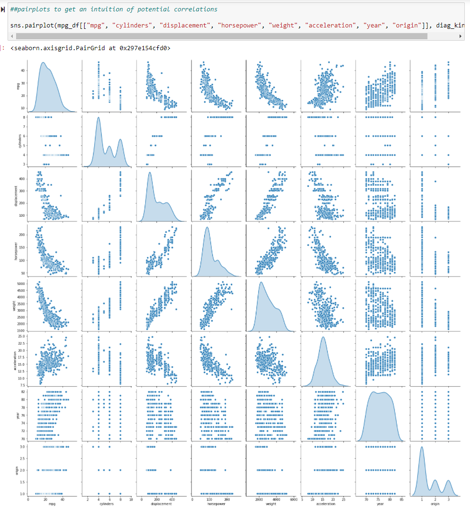</kbd>

 
Training of the data begins... 
 

<kbd>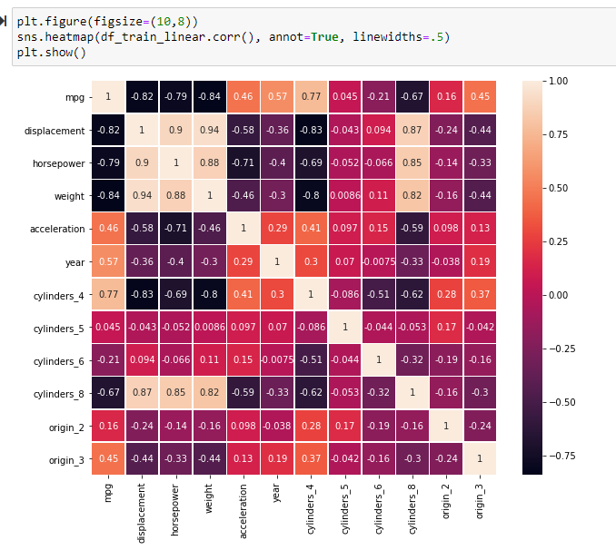</kbd>

 
Linear models explored include Linear, Ridge, Lasso, and ElasticNet.   
 

<kbd>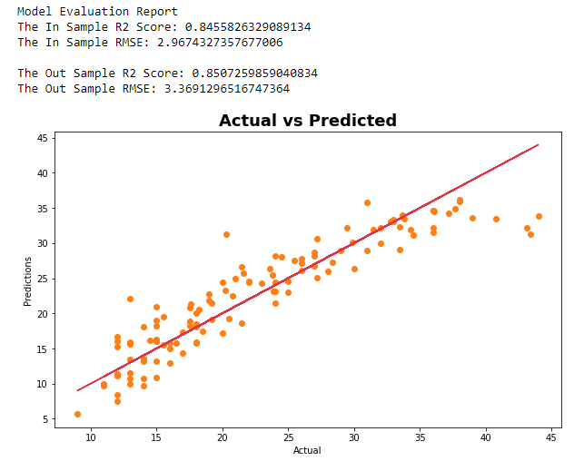</kbd>&nbsp;&nbsp;&nbsp;<kbd></kbd>

 
Random Forest models explored are DecisionTree, Random Forest, AdaBoost, and Gradient Boost. 
 

<kbd></kbd>

 
Model results were viewed as a dataframe for easy comparison. 
 

<kbd>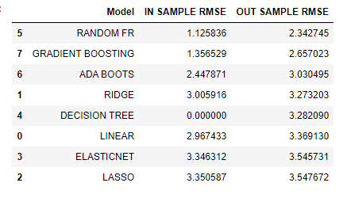</kbd>

 
The Random Forest model was choosen because it has the lowest RMSE and doesn't overfit the in sample data.  
 

<kbd>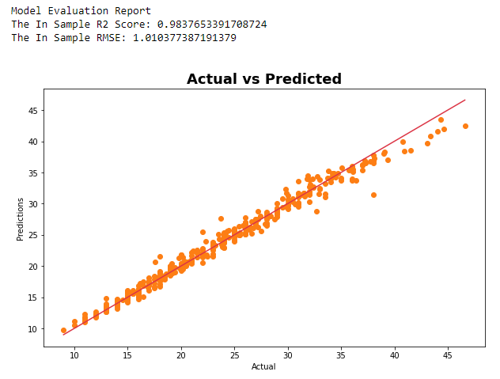</kbd>

 
<h3>Web Deployment</h3>

The project is packaged as a full stack web deployment on Heroku.  
The "Garage" page introduces the user to the project. it includes an interactive slideshow with twelve car images from the time period. A navigation bar allows the user to visit several different pages:  

Visualizations - This is the Tableau storyboard

Machine learning - This is the predictive activity

The Mechanics - This is the explanation of the Machine Learning behind the prediction.

Under the Hood - This is the dataset. This can be filtered by one to three metrics.

About Us - This is the team that crafted the project.

 

<kbd>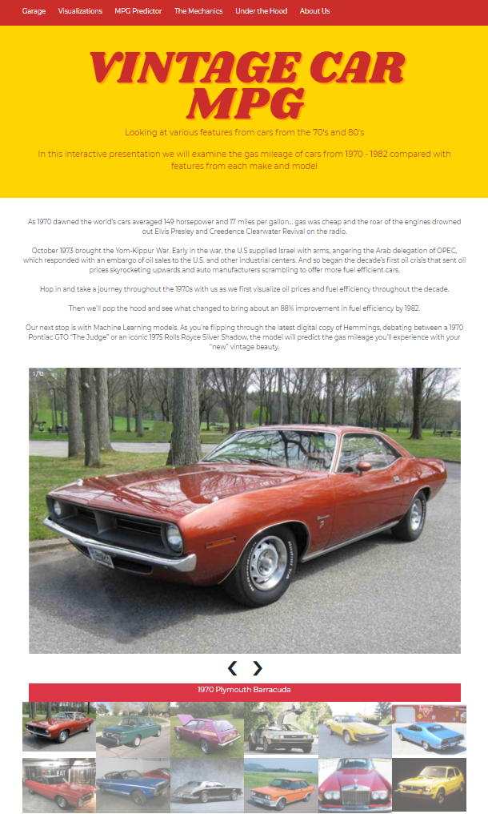</kbd>  
<kbd>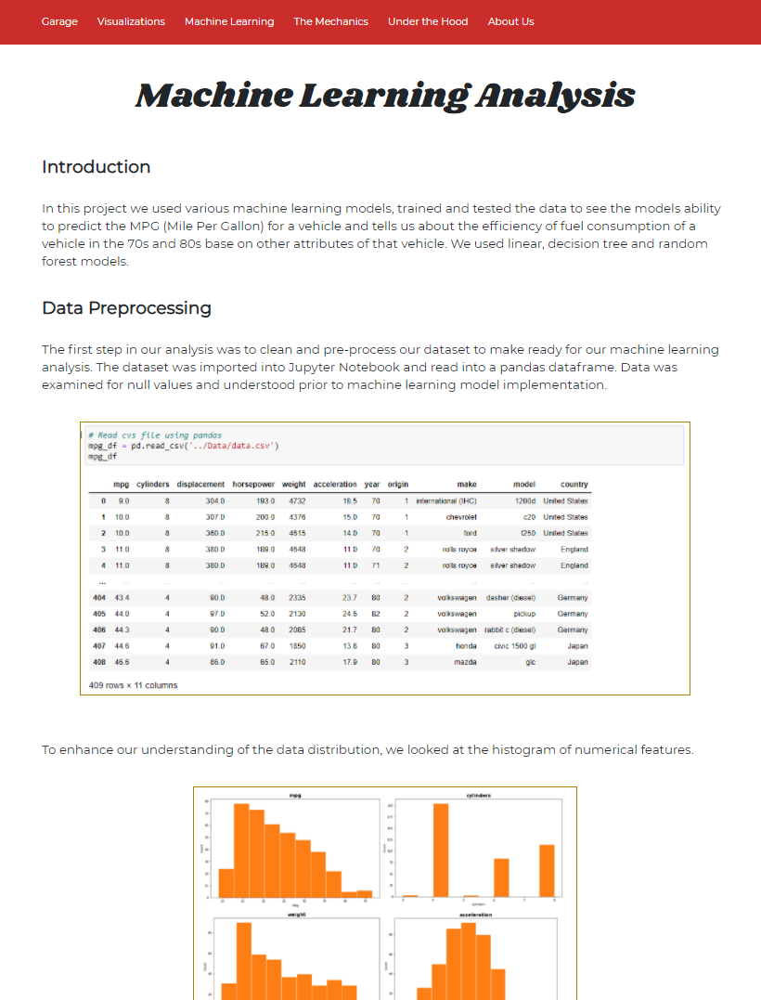</kbd>    
<kbd>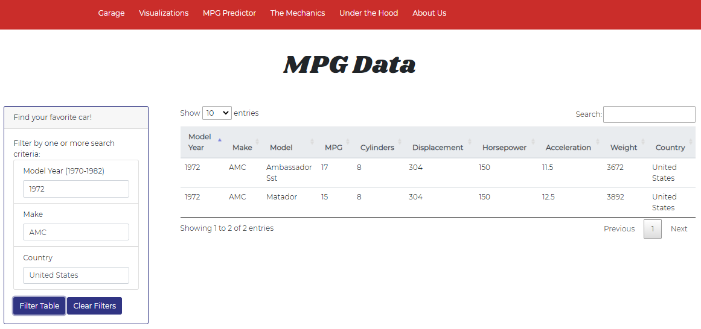</kbd>
 
 
 

<kbd></kbd>
                      
 
</body>
</html>
